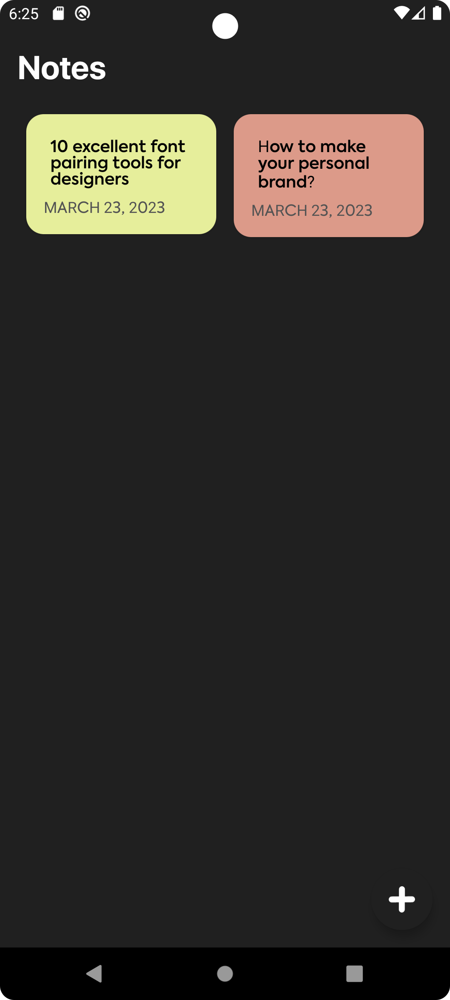

# Tangible Notes
This is a note-taking Android app that uses modern Android development techniques and libraries, including Kotlin, Hilt, Room, Coroutines, and FastAdapter.

# Features
- Create new notes
- Edit existing notes
- Delete notes
- Dark mode

# Stack
- Kotlin
- MVVM
- Android Architecture Components (Room, LiveData, ViewModel)
- Hilt for Dependency Injection
- Coroutines for asynchronous programming
- FastAdapter for RecyclerView handling
- Material Design components

# Screenshots

# Getting Started
## Prerequisites
- Android Studio 4.1 or later
- Android SDK 26 or later

## Installation
- Clone the repository: git clone https://github.com/your_username/your_project_name.git
- Open the project in Android Studio.
- Build and run the app on an emulator or a physical device.

## Usage
- Tap the "+" button to create a new note.
- Tap an existing note to view and edit its contents.

# Contributing
Pull requests are welcome. For major changes, please open an issue first to discuss what you would like to change.

Please make sure to update tests as appropriate.
